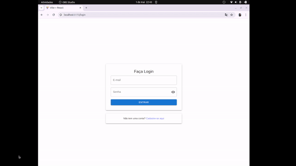
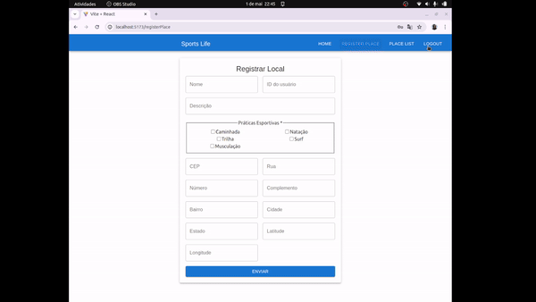

# SPORTS LIFE

## Descrição
Este é um sistema desenvolvido para gerenciar locais de exercícios, permitindo que os usuários cadastrem, gerenciem e visualizem diferentes locais para a prática de atividades físicas.

## Problema
Muitas vezes, as pessoas enfrentam dificuldades para encontrar locais adequados para a prática de exercícios físicos. Este sistema visa facilitar esse processo, permitindo que os usuários cadastrem e encontrem locais de exercícios próximos a eles ou em locais onde desejam.

## Técnicas e Tecnologias Utilizadas
- Desenvolvimento utilizando a biblioteca React.
- Estilização do layout utilizando Material UI.
- Utilização da API do ViaCEP para obtenção de informações de endereços.
- Armazenamento de dados utilizando localStorage para usuários e json-server para locais de exercícios.
- Responsividade para adaptação em telas grandes e pequenas.
- Implementação do mapa utilizando a biblioteca Leaflet.

## Como Executar
1. Clone o repositório para sua máquina local.
2. Instale as dependências utilizando `npm install`.
3. Instale e inicie o servidor backend com JSON-SERVER utilizando `npm install -g json-server` e `json-server --watch ./data/db.json`.
4. Inicie o servidor frontend utilizando `npm run dev`.
5. Acesse a aplicação em seu navegador através do endereço fornecido no terminal, normalmente é o: `http://localhost:5173/`.
6. Na página de login, clique em "Criar conta" para registrar-se.
7. Após criar uma conta, você será redirecionado para a página login, faça o login.

8. Na página inicial, você pode visualizar os locais de exercícios cadastrados e explorar outras funcionalidades disponíveis.
9. Para adicionar um novo local de exercício, clique em "Adicionar local".
10. Você pode editar ou excluir um local de exercício na página de listagem de locais.
11. Utilize o menu de navegação para acessar diferentes partes da aplicação ou sair da conta.
12. Ao termino faça o logout.

## Melhorias Futuras
- Implementar recuperação de senha.
- Permitir edição e exclusão de contas.
- Substituir o JSON-SERVER por um servidor backend mais robusto.
- Adicionar mais funcionalidades, como filtros de busca e categorização dos locais de exercícios.
- Utilizar uma API que automaticamente obtenha a longitude e latitude do endereço informado.

## Páginas
### Login
- Permite a entrada no sistema do usuário e o redirecionamento para o cadastro.

### RegisterUser
- Criação da conta do usuário.

### Dashboard
- Exibe uma visão geral dos locais de exercícios cadastrados e dos usuários, com opção de visualização em um mapa.

### RegisterPlace
- Tela para cadastrar e editar locais de exercícios.

### PlaceList
- Tela para listar todos os locais de exercícios, com opções para editar e excluir.

### Menu
- Navegação entre as diferentes telas e botão de sair.
